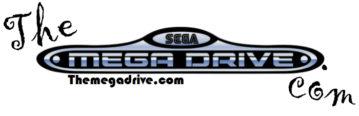
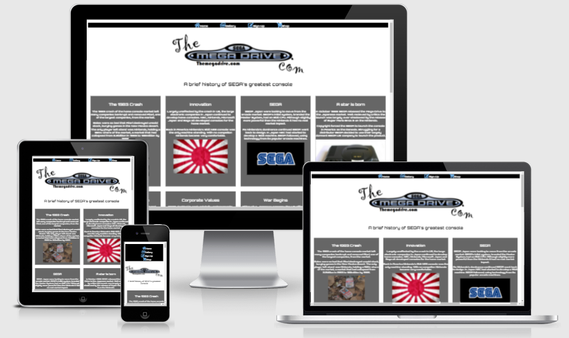
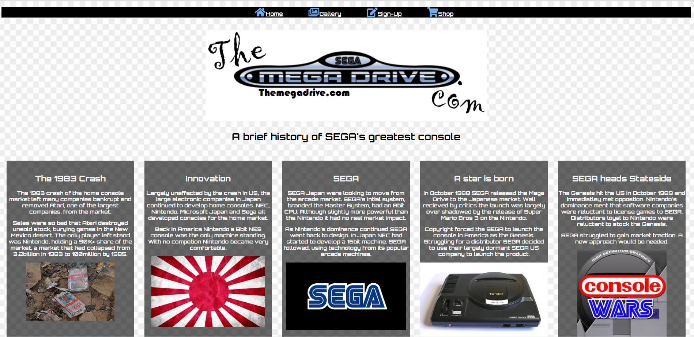
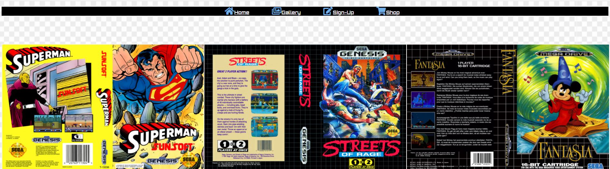
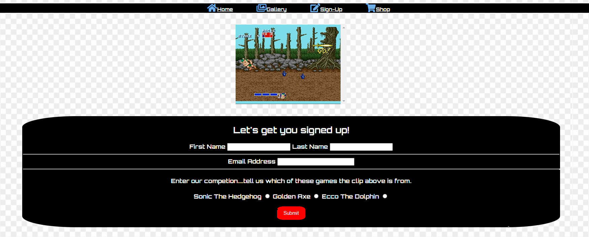
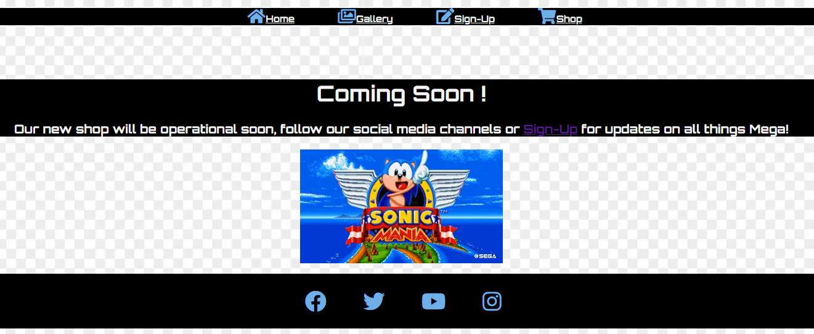
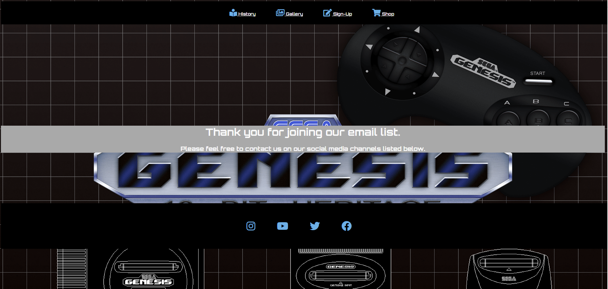
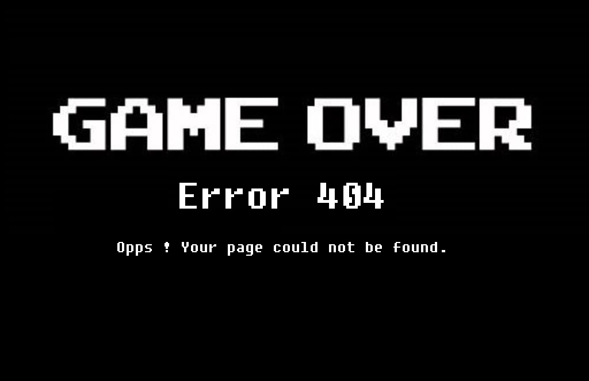
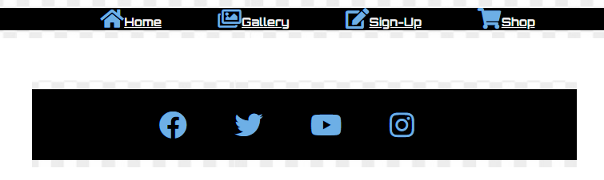
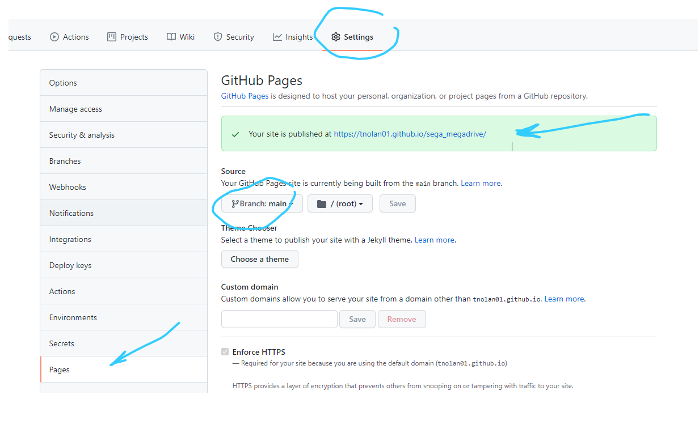

[The MEGADRIVE.COM](https://tnolan01.github.io/sega_megadrive/index.html)


## Project Scope:

This site is designed for fans and potential fans of gaming, gaming consoles and retro electronics. The principal aim of the site to atttact and interest fans of the gaming console the SEGA Mega Drive, also known as the Genesis.
The site hopes to generate feelings of nostalgia from an audience whom would have originally used the console as a child while also appealing to the current generations who may be interested in gaming and associated pop culture.

In recent years a market has developed retro and vintage technology with the youth market being interested in collectables and pop iconography associated with video games and gaming franchises. 




## Features Of The Site:

The site consists of the following sections.

 - The Load Page - index.hmtl
 - The History Page - history.html
 - The Gallery Page - gallery.html
 - Sign-up Page - sign_up.html
 - Shop Page - shop_html
 - Thank You Page - thank_you.html
 - Header Section
 - Footer Section


### The Load Page:
The Load Page, index.html, guides you into the various aspects of the website. The colour scheme is dark to match styling of the SEGA's packaging. The page contains a full header and footer and a centre text box with links to pages on the site.


### The History Page:
The History Page use a CSS Grid structure which contains grid items. Each grid item acts as a tile and contains text with an associated image to detail the history and life cycle of the console. The principal idea is to make a compelling argument for the historical importance of this console in creating one of the largest entertainment industries in the world.



### The Gallery:
The Gallery Page displays a collection of images of the games packaging associated with the cartridges which were used on the Mega Drive / Genesis platform. These images make a vibrant collage and on their own are visually appealing. Such images can invoke interest and nostalgia.



### The Sign Up Page:
This is to gather email contact details to use to send 'newsletters' to followers and potential customers. The page contains a GIF image from a popular game as part of a simple quiz to entice viewers to sign up. 



### The Shop Page:
At present this page is not completed or structured but it offers a platform for the sale of game related merchandise of all types from clothing to games and accessories to consoles.



### Thank You Page:
The thank you page displays once the user has filled out the sign up form. This page displays a different wallpaper which is unique to this page.



### 404 Page:
I have created a custom 404 page to match the theme overall theme of the website with a console game related message. Game Over.



### The Header and Footer:
The header and footer are identical across all pages and designed to be modern and non-distracting but visually prominent so as to be borders to the particular page.




## Design Stylings:

The background is a white and light grey square pattern which is based on the color scheme used in some of the orignal game packaging. The background is light as to not distract from the items on the page and give the site a cleaner, modern appearance.

The header and footer are black to clearly distinguish them on the back ground. The icons and text are a blue color, rgb(109, 175, 230). This is taken from the blue in the Mega Drive logo. The silver in the logo was too light a color to use.

The color of Header and Footer icons change color on 'hover' , that color is rgb(156, 134, 9), this is a gold color and is abstract to the blue for differentiation purposes. The gold color was inspired by the gold text on the '16 Bit' Logo which was on the emblazed across the front casing of the MK1 Mega Drive case and Genesis.

I have used the font Orbitron from Google Fonts. Originally I looked for a 'retro' 80's computer style but these fonts appeared clumsy and difficult to read on smaller screens. Orbitron and the shape but with a modern finish.


The shape of the form is a silhouette of the Megadrive 2 console. The red submit button is based on the 'power' and 'reset' buttons on that console.


## Testing:

I have tested the site on Google Chrome, Microsoft Edge, AVG Secure Browser, Safari and Amazon Silk.


The site was tested on the folowing devices which have varying screen sizes.
* Windows 10 PC with 27" LCD Screen
* Windows 10 PC with 24" LCD Screen
* Samsung Galaxy TAB2 10.1" Screen
* Apple IPAD 2 9.7" Screen
* Apple IPhone 8 - phone
* Motorola Moto 8 - phone
* Motorola Moto 10 - phone
* Amazon Fire Tablet 8"

Media queires were created and altered many times to get the right amount data to display on the appropriate sized screen.

**Validator Testing:**

- HTML
  - No errors were returned when passing through the official [W3C validator](https://validator.w3.org/nu/?doc=https%3A%2F%2Ftnolan01.github.io%2Fsega_megadrive%2Findex.html)
- CSS
  - No errors were found when passing through the official [(Jigsaw) validator](https://jigsaw.w3.org/css-validator/validator?uri=https%3A%2F%2Ftnolan01.github.io%2Fsega_megadrive%2Findex.html&profile=css3svg&usermedium=all&warning=1&vextwarning=&lang=en)

## Web.Dev Check-up:
I checked the performance of the site through the web.dev website. Image of details below. 


## Deployment:

This was coded through GitPod and deployed to GitHub pages. An outline of the deployment procedure is as follows:
* In the GitHub repository select the Settings tab on the bar, it is the last item.
* In the drop-down menu on left select the 'Pages', this is presently 2nd from bottom on the menu. 
* In the 'Source' section at the top of the 'GitHub Pages' select Branch as 'Main'.
* A green box should appear above the 'Source' section with an refreshed ribbon to indicate the site has been successfully deployed and showing the address to which it is published.



Live Link : https://tnolan01.github.io/sega_megadrive/index.html

## Cloning:


[Click here](https://help.github.com/en/github/creating-cloning-and-archiving-repositories/cloning-a-repository#cloning-a-repository-to-github-desktop) to retrieve pictures for some of the buttons and more detailed explanations of the above process.

1. Log in to GitHub and locate the [GitHub Repository] https://github.com/TNolan01/sega_megadrive
  2. Under the repository name, click "Code".
  3. To clone the repository using HTTPS. Under "HTTPS" copy the link.
  4. Go to your local terminal with git installed
  5. Change the current working directory to the location where you want the cloned directory to be created/located.
  6. Type `git clone` and then you paste in the URL you copied in Step 3.

  ```
  $ git clone https://github.com/TNolan01/sega_megadrive.git
  ```

  7. Press Enter. Your local clone will be created.


## Credits:

Coded with help from:
* DesignCourse: Youtube channel which I watched to study CSS Grid. https://youtu.be/bam83Xv4VMA
* W3 Schools: Search guide on various topics. https://www.w3schools.com/css/
* Code Institute 'Loving Running' Project: Used the gallery html structure as demostrated in Loving Running, also used the associated Read Me file as a guide.
* Stack Overflow.
* A little help from Slack searches.


#### Content:
* Text on the index_html based on Wikipedia based under a search for 'console war' https://en.wikipedia.org/wiki/Console_war.
* Images from index_html are from wikipedia.
* The book 'Console Wars' by Blake J Harris must also be referenced as its largely where the Wikipedia content comes from. https://en.wikipedia.org/wiki/Console_Wars_(book).
* All the images in the gallery were sourced from Cover Century. https://www.covercentury.com/index.php?p=genesiscovers.
* I used two GIF's from Tenor.com. https://tenor.com/search/sega-gifs
* The background image on the index.html came from https://images7.alphacoders.com/866/thumb-1920-866932.png.

#### Styling:
* Icon images on header and footer are from Font Awesome. https://fontawesome.com/
* I aslo used an import font, Orbitron, from Google Fonts. https://fonts.google.com/
* The 'Sega Mega Drive' logo at the top of the index_html is from Wikipedia, I have altered it slightly using MS Paint.

## Conclusion:
* There are improvements which could be made to the site in terms of additional uer interaction.
* I would approach the design and layout differently on next project. This project was very much designed as it evolved and the IDE is not the correct place for this. 
* I would also need to increase the number of 'commits' on future projects. This is aspect of the procedure which I did not fully appreciate.


### Please Note : All content used is for the non-commercial site, as part of an educational project and not for any commercial or financial benefit.

